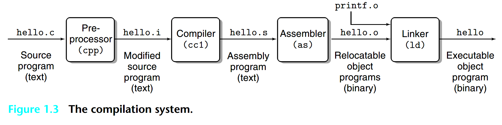
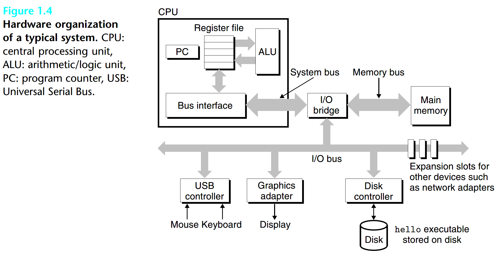
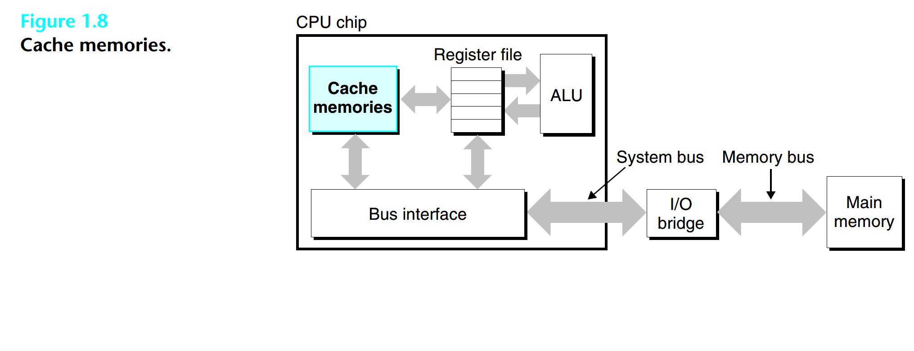
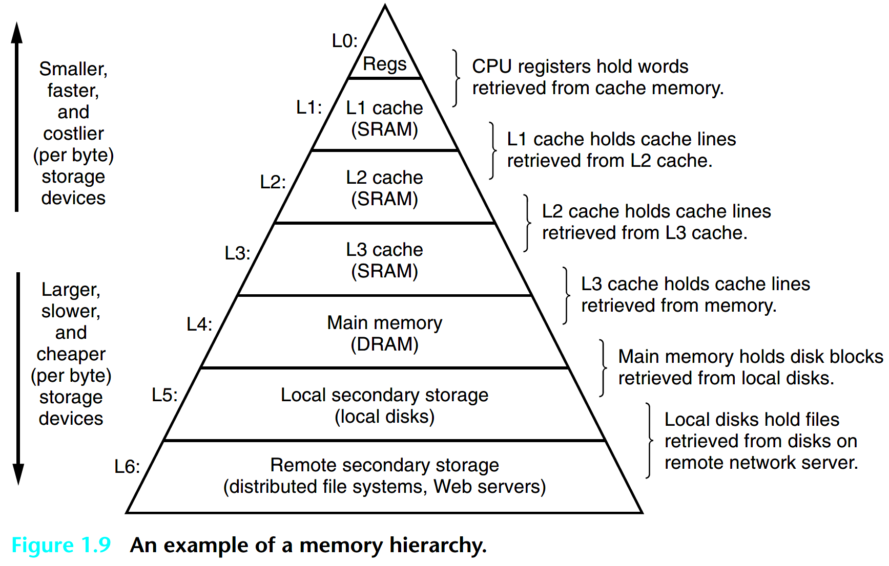
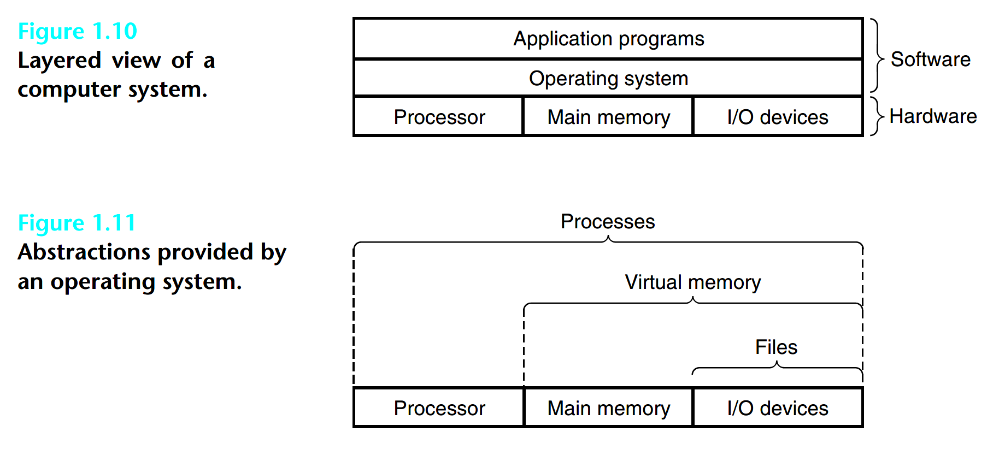
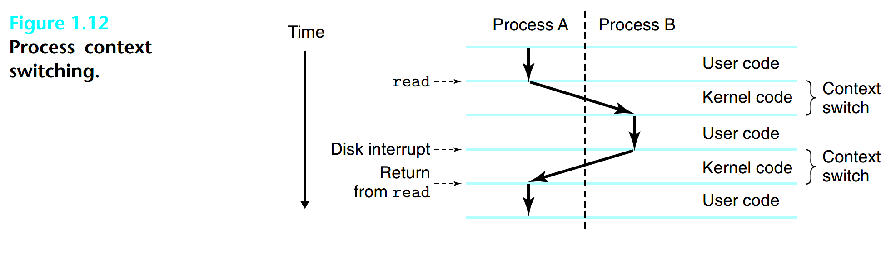
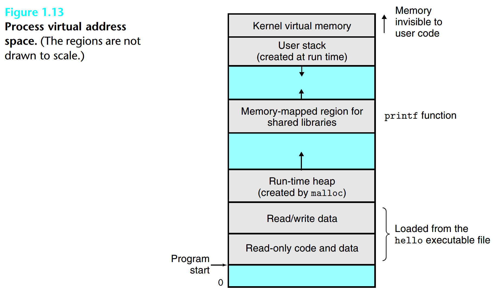
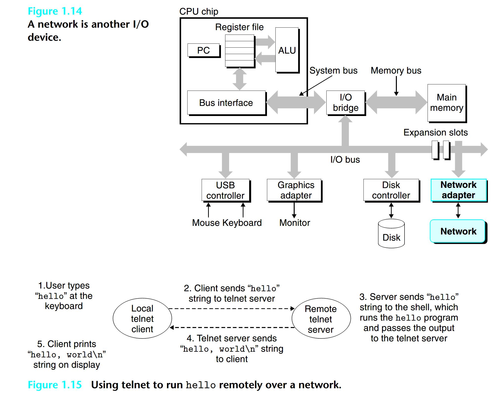
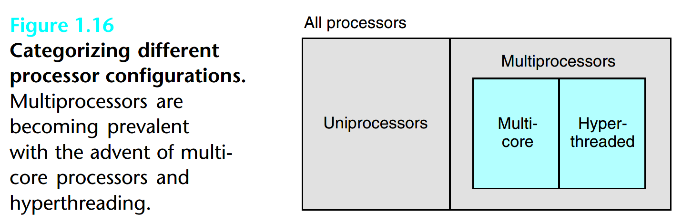
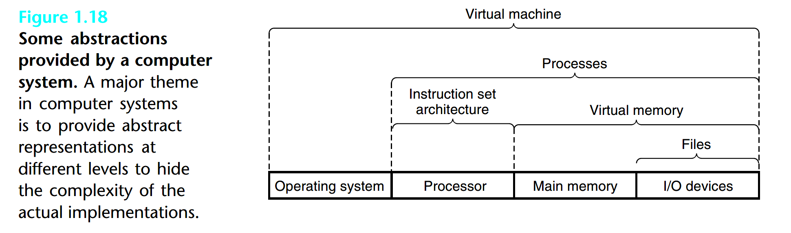

## CSAPP

### Chapter 1: Tour of Computer Systems

#### 1. 1 Information Is Bits + Context

**source program**: is a sequence of bits, each with a value of 0 or 1, organized in 8-bit chunks called bytes.

Files such as hello.c that consist exclusively of ASCII characters are known as **text files**. All other files are known as **binary files**.

All information in a system is represented as a bunch of bits. The only thing that distinguishes different data objects is the **context** in which we view them. 

C is the language of choice for **system-level programming**, and there is a huge installed base of
application-level programs as well. However, it is not perfect for all programmers and all situations.
**C pointers** are a common source of confusion and programming errors. 

#### 1.2 Programs Are Translated by Other Programs into Different Forms

In order to run hello.c on the system, the individual C statements must be translated by other programs into **a sequence of low-level machine-language instructions**. These instructions are then packaged in a form called an executable object program and stored as a binary disk file. 

The programs that perform the **four phases** (preprocessor, compiler, assembler, and linker) are known collectively as the **compilation system**.

**Preprocessing phase:** The preprocessor (cpp) modifies the original C program according to directives that begin with the ‘#’ character. 

**Compilation phase:** The compiler (cc1) translates the text file hello.i into the text file hello.s, which contains an assembly-language program. 

**Assembly phase:** Next, the assembler (as) translates hello.s into machine-language instructions, packages them in a form known as a relocatable object program, and stores the result in the object file hello.o. 

**Linking phase: **The printf function resides in a separate precompiled object file called printf.o, which must somehow be merged with our hello.o program. The linker (ld) handles this merging. The result is the hello file, which is an executable object file (or simply executable) that is ready to be loaded into memory and executed by the system.

#### 1.3 It Pays to Understand How Compilation Systems Work

there are **some important reasons why programmers need to understand how compilation systems work**:

- **Optimizing program performance:** In order to make good coding decisions in our C programs, we do need a basic understanding of machine-level code and how the compiler translates different C statements into machine code. 
- **Understanding link-time errors:** In our experience, some of the most perplexing programming errors are related to the operation of the linker, especially when you are trying to build large software systems. 
- **Avoiding security holes:** For many years, buffer overflow vulnerabilities have
  accounted for many of the security holes in network and Internet servers. These  vulnerabilities exist because too few programmers understand the need to carefully restrict the quantity and forms of data they accept from untrusted sources. 

#### 1.4 Processors Read and Interpret Instructions Stored in Memory

##### 1.4.1 Hardware Organization of a System

**Buses:**  Running throughout the system is a collection of electrical conduits called buses that carry bytes of information back and forth between the components. Buses are typically designed to **transfer fixed-size chunks of bytes known as words**. The number of bytes in a word (the word size) is a fundamental system parameter that varies across systems. Most machines today have word sizes of either 4 bytes (32 bits) or 8 bytes (64 bits). 

**I/O Devices: **Input/output (I/O) devices are the system’s connection to the external world. 

Each I/O device is connected to the I/O bus by either a **controller** or an **adapter**. The distinction between the two is mainly one of packaging. Controllers are chip sets in the device itself or on the system’s main printed circuit board (often called the motherboard). An adapter is a card that plugs into a slot on the motherboard. Regardless, the purpose of each is to **transfer information back and forth between the I/O bus and an I/O device.**

**Main Memory:** The main memory is a temporary storage device that holds both a program and the data it manipulates while the processor is executing the program. 

Physically, main memory consists of a collection of dynamic random access memory (DRAM)
chips. Logically, memory is organized as a linear array of bytes, each with its own unique address (array index) starting at zero. 

In general, each of the machine instructions that constitute a program can consist of a variable number of bytes. The sizes of data items that correspond to C program variables vary according
to type. 

**Processor:** The central processing unit (CPU), or simply processor, **is the engine that interprets**
**(or executes) instructions stored in main memory.** At its core is a word-size storage device (or register) called the program counter (PC). At any point in time, the PC points at (contains the address of) some machine-language instruction in main memory.

A processor repeatedly executes the instruction pointed at by the program counter and updates the program counter to point to the next instruction. A processor appears to operate according to a very simple instruction execution model, defined by its instruction set architecture. In this model, instructions execute in strict sequence, and executing a single instruction involves performing a series of steps. 

The processor reads the instruction from memory pointed at by the program counter (PC), interprets the bits in the instruction, performs some simple operation dictated by the instruction, and then updates the PC to point to the next instruction, which may or may not be contiguous in memory to the instruction that was just executed.

**The register file** is a small storage device that consists of a collection of word-size registers, each with its own unique name. **The ALU** computes new data and address values. 

Simple operations that the CPU might carry out at the request of an instruction:

- **Load:** Copy a byte or a word from main memory into a register, overwriting
  the previous contents of the register.
- **Store:** Copy a byte or a word from a register to a location in main memory,
  overwriting the previous contents of that location.
- **Operate:** Copy the contents of two registers to the ALU, perform an arithmetic
  operation on the two words, and store the result in a register, overwriting the
  previous contents of that register.
- **Jump:** Extract a word from the instruction itself and copy that word into the
  program counter (PC), overwriting the previous value of the PC.

We can distinguish the processor’s **instruction set architecture**, describing the effect of each machine-code instruction, from its **microarchitecture**, describing how the processor is actually implemented. 

#### 1.5 Caches Matter

To deal with the processor–memory gap, system designers include smaller, faster storage devices called **cache memories** (or simply caches) that **serve as temporary staging areas for information** that the processor is likely to need in the near future. 

The L1 and L2 caches are implemented with a hardware technology known as **static random access memory (SRAM)**. 

The idea behind caching is that a system can get the effect of both a very large memory and a very fast one by exploiting **locality**, **the tendency for programs to access data and code in localized regions**. 

#### 1.6 Storage Devices Form a Hierarchy

The main idea of a memory hierarchy is that storage at one level serves as a cache for storage at the next lower level. 

#### 1.7 The Operating System Manages the Hardware

We can think of the operating system as a layer of software interposed between the application program and the hardware. **All attempts by an application program to manipulate the hardware must go through the operating system.**

The operating system has two primary purposes: (1) to **protect the hardware from misuse by runaway applications** and (2) to **provide applications with simple and uniform mechanisms for manipulating complicated and often wildly different low-level hardware devices**. 

The operating system achieves both goals via the fundamental abstractions shown in Figure 1.11: **processes, virtual memory, and files**. As this figure suggests, files are abstractions for I/O devices, virtual memory is an abstraction for both the main memory and disk I/O devices, and processes are abstractions for the processor, main memory, and I/O devices. 

##### 1.7.1 Processes

The operating system provides the illusion that the program is the only one running on the system. The program appears to have exclusive use of both the processor, main memory, and I/O devices. The processor appears to execute the instructions in the program, one after the other, without interruption. And the code and data of the program appear to be the only objects in the system’s memory. 
A process is the operating system’s abstraction for a running program. **Multiple processes can run concurrently on the same system**, and each process appears to have exclusive use of the hardware. **By concurrently, we mean that the instructions of one process are interleaved with the instructions of another process.** In most systems, there are more processes to run than there are CPUs to run them.

Newer multicore processors can execute several programs simultaneously. 

A single CPU can appear to execute multiple processes concurrently by having the processor switch among them. The operating system performs this interleaving with a mechanism known as **context switching**. 

The operating system keeps track of all the state information that the process needs in order to run. This state, which is known as the **context**, includes information such as **the current values of the PC, the register file, and the contents of main memory.** 

**A uniprocessor system can only execute the code for a single process.** When the operating system decides to transfer control from the current process to some new process, it performs a context switch by saving the context of the current process, restoring the context of the new process, and then passing control to the new process. The new process picks up exactly where
it left off. 

**The transition from one process to another is managed by the operating system kernel.** The kernel is the portion of the operating system code that is always resident in memory. When an application program requires some action by the operating system, such as to read or write a file, **it executes a special system call instruction**, transferring control to the kernel. The kernel then performs the requested operation and returns back to the application program. **Note that the kernel is not a separate process. Instead, it is a collection of code and data structures that the system uses to manage all the processes**.

##### 1.7.2 Threads

In modern systems **a process can actually consist of multiple execution units, called threads,** each running in the context of the process and **sharing the same code and global data**. 

##### 1.7.3 Virtual Memory

**Virtual memory is an abstraction that provides each process with the illusion that it has exclusive use of the main memory.** Each process has the same **uniform view of memory**, which is known as its **virtual address space**. 

In Linux, the **topmost region** of the address space is **reserved for code and data** in the operating system that is common to all processes. **The lower region of the address space holds the code and data defined by the user’s process**. **Note that addresses in the figure increase from the bottom to the top.**

- **Program code and data:** Code begins at the same fixed address for all processes, followed by data locations that correspond to global C variables. The code and data areas are initialized directly from the contents of an executable object file.
- **Heap:** The code and data areas are followed immediately by the run-time heap. The heap expands and contracts dynamically at run time as a result of calls to C standard library routines such as **malloc and free**. 
- **Stack:** At the top of the user’s virtual address space is the user stack that the compiler uses to **implement function calls**. Like the heap, the user stack expands and contracts dynamically during the execution of the program. **In particular, each time we call a function, the stack grows. Each time we return from a function, it contracts.** 
- **Kernel virtual memory:** The top region of the address space is reserved for the kernel. **Application programs are not allowed to read or write the contents of this area or to directly call functions defined in the kernel code.** Instead, they must invoke the kernel to perform these operations.

##### 1.7.4 Files

A file is **a sequence of bytes**, nothing more and nothing less. Every I/O device, including disks, keyboards, displays, and even networks, is modeled as a file. All input and output in the system is performed by reading and writing files, using a small set of system calls known as Unix I/O.

This simple and elegant notion of a file is nonetheless very powerful because **it provides applications with a uniform view of all the varied I/O devices that might be contained in the system**. 

#### 1.8 Systems Communicate with Other Systems Using Networks

#### 1.9 Important Themes

##### 1.9.1 Amdahl’s Law

**A simple but insightful observation about the effectiveness of improving the performance of one part of a system.** This observation has come to be known as Amdahl’s law. The main idea is that **when we speed up one part of a system, the effect on the overall system  performance depends on both how significant this part was and how much it sped up.**

 																		$S = \frac{1}{(1 − α) + α/k}$

This is the major insight of Amdahl’s law— to significantly speed up the entire system, we must improve the speed of a very large fraction of the overall system.

##### 1.9.2 Concurrency and Parallelism

We use the term **concurrency to refer to the general concept of a system with multiple, simultaneous activities**, and the term **parallelism to refer to the use of concurrency to make a system run faster**. Parallelism can be exploited at multiple levels of abstraction in a computer system.  

**Thread-Level Concurrency**

We are able to devise systems where **multiple programs execute at the same time**, leading to concurrency. **With threads, we can even have multiple control flows executing within a single process.** 

Until recently, **most actual computing was done by a single processor, even if that processor had to switch among multiple tasks.** This configuration is known as a **uniprocessor system**.

When we construct a system consisting of multiple processors all under the control of a single operating system kernel, we have a **multiprocessor system**.

The cores share **higher levels of cache** as well as **the interface** to main memory. 

Hyperthreading, sometimes called **simultaneous multi-threading**, is a technique that **allows a single CPU to execute multiple flows of control.** 

A hyperthreaded processor **decides which of its threads to execute on a cycle-by-cycle basis**. It enables the CPU to take better advantage of its processing resources.

The use of multiprocessing can improve system performance in two ways. First, it **reduces the need to simulate concurrency when performing multiple tasks.** Second, it can **run a single application program faster, but only if that program is expressed in terms of multiple thread that can effectively execute in parallel.**

**Instruction-Level Parallelism**

At a much lower level of abstraction, modern processors can **execute multiple instructions at one time, a property known as instruction-level parallelism.** 

**Processors that can sustain execution rates faster than 1 instruction per cycle are known as superscalar processors**. Most modern processors support superscalar operation. 

**Single-Instruction, Multiple-Data (SIMD) Parallelism**

At the lowest level, many modern processors have special hardware that **allows a single instruction to cause multiple operations to be performed in parallel,** a mode known as single-instruction, multiple-data (SIMD) parallelism. 

**These SIMD instructions are provided mostly to speed up applications that process image, sound, and video data.** Although some compilers attempt to automatically extract SIMD parallelism from C programs, a more reliable method is to write programs using special vector data types supported in compilers such as gcc.

##### 1.9.3 The Importance of Abstractions in Computer Systems

On the processor side, **the instruction set architecture provides an abstraction of the actual processor hardware**. 

With this abstraction, a machine-code program behaves as if it were executed on a processor that performs just one instruction at a time. The underlying hardware is far more elaborate, executing multiple instructions in parallel, but always in a way that is consistent with the simple, sequential model. By keeping the same execution model, different processor implementations can execute the same machine code while offering a range of cost and performance.

**The virtual machine:** providing an abstraction of the entire computer, including the operating system, the processor, and the programs. 